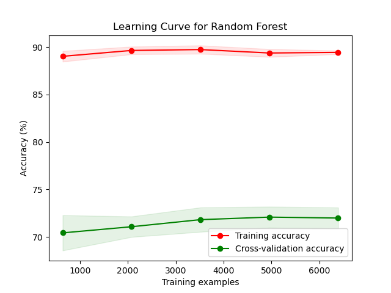
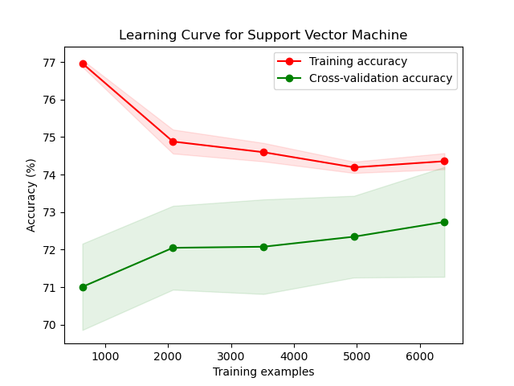
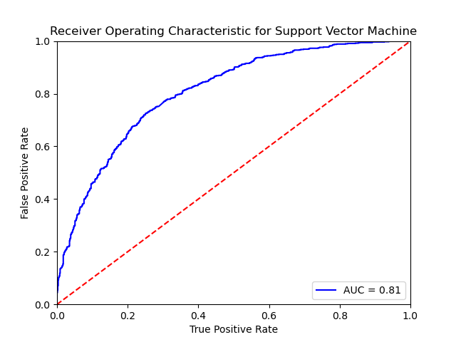

# Introduction

FIFA World Cup is the most popular sports event in the world. As shown in the image below [5], its viewership surpasses all other major sports events. With the popularity of the sport comes the importance of predictive analysis of the tournament and its matches. A lot of industries seek a good prediction at different levels for these matches for different purposes like sports betting, media and broadcast analysis, tactical decision making, driving online fan excitement. 

FIFA World Cup happens once in four years with 32 participating teams. First, 8 groups are created with 4 teams each. In every group, each team plays the other once. 3 points are given to the winner, 0 to the loser, and 1-1 point is shared in case of a draw. After this, top 2 teams from each group qualify for knockout stages. In knockouts, each team plays a match per stage where winner moves to the next stage and loser is eliminated, until one team ultimately wins the tournament.

In this work, we predict the FIFA World Cup matches and ideal grouping of teams for a good tournament using past match results and rankings. In summary, we use these data to generate relevant features, and then use multiple supervised techniques to predict winner of a match. Apart from real data, we also explore creating fictitious matches and use semi-supervised learning in an attempt to improve the models. Alongside match predictions, we also use unsupervised clustering techniques to create groups that can facilitate a good tournament. Through these two processes, we create an end-to-end tool that can take in participating teams, build groups, predict results of matches and ultimately, predict a complete tournament.

# Related Work

The problem of predicting game outcomes especially in Football (also called Soccer in North America) is usually handled as a classification problem [4],[6]. Techniques ranging from logistic regression [4] to RNN/Deep Learning [6] have been employed for this task. Furthermore the problem of outcome prediction is very similar across other team sports [1],[3]. A comprehensive survey of the use of techniques across the various sports is described in [3].

# Method Overview

## Problem Definition

A tournament \\(\mathcal{T}(\boldsymbol{T},\boldsymbol{G},\boldsymbol{T_b})\\) is a set of teams \\(\boldsymbol{T}\\) participating in games \\(\boldsymbol{G}\\) (either a winner or tie (only in  group stage)) over stages \\(\boldsymbol{b} = 0,1,2,...\\) ,with a set of (\\(\boldsymbol{T_b}\\)) teams qualifying to play them. Our goal is:

1. **Outcome prediction** : \\(\forall G(T_i,T_j) \in \boldsymbol{G}\\) we predict \\(\hat{G}(T_i,T_j)\\) accurately.
2. **Group Prediction** : Given  \\(\boldsymbol{T_b}\\) we predict \\(\hat{T}_{b+1}\\) and beyond. 

The notion of "accuracy" in our case is also quantified by additional metrics like **cross-entropy** , **precision** , **recall** and **F1-score** (discussed below in the metrics section.)

For our project we handle **Group Prediction** by using **Outcome Prediction** iteratively to predict the matches within the group.

For the midsem checkpoint we will be covering **Outcome Prediction** in the report.

## Outcome Prediction

To predict the outcomes, we first extract features for a match fixture using domain knowledge and correlation analysis. For the two teams playing, we take last $n_{ind}$ individual matches in FIFA World Cups and qualifiers against any team. From this, we extract number of wins, goals scored (mean, std), goals conceded (mean, std), mean of rank difference of this team against oppositions played for each team. Alongside this, we also take in the current rank of the teams. After this, we take last $n_{h2h}$ matches against each other in the same category and extract difference in rank of the teams and mean, std of goals scored by both the teams. We also take a categorical variable of whether the match is at a neutral venue, and if it is a world cup match or a qualifier. Complete set of features are described in the table below. To get the labels, we compare the goals scored for both teams in the match and if home_team scores more, we make the label = 1, otherwise 0.

Using these features, we train build a binary classifier using various algorithms. To start, we implement Logistic Regression [X], Support Vector Machines [X], Decision Tree [X] which are simple, efficient and interpretable algorithms and them move to ensemble methods like , Random Forest [X], and Gradient Boost [X] to predict the probability of team A winning the match. In working with the classifier, we also experiment with forward feature selection [X] to select best features from the initial feature set, and also do Principal Component Analysis [X] to reduce the dimensionality of features. We tune all these methods by defining a search space and using Randomized Search using k-fold cross validation.

As we realize that the number of data can also be a cause of concern since World Cups happen once every four years in a space of two months, we generate artificial permutation of matches of two teams. To do this, we take a date $D$ and team playing a match on that day $T_D$. Then, for each team $T_D^i$ in this set, if the team has played against a set $T_R$ teams in the past, we generate a match between $T_D^i$ and each member of set $T_R - T_D$. After this, we select a random $N_A$ set of matches from this and follow a semi-supervised learning [X] approach to train the classifier using labeled real matches and this unlabeled artificial matches to predict the results.

## Group Prediction

We will do the unsupervised group prediction post mid-sem of this project.

## Overall Pipeline

# Implementation Details

## Dataset
We use the datasets listed below:
- [Soccer World Cup Data (Kaggle)](https://www.kaggle.com/datasets/shilongzhuang/soccer-world-cup-challenge/){:target="_blank"} 
- [All International Matches (Kaggle)](https://www.kaggle.com/datasets/martj42/international-football-results-from-1872-to-2017?select=results.csv){:target="_blank"} 
- [FIFA World Rankings (Kaggle)](https://www.kaggle.com/datasets/cashncarry/fifaworldranking){:target="_blank"} 

The dataset features are described in the following figure -

Of these the datasets **All International Matches** and **FIFA World Rankings** are used to train and test our Machine Learning schemes ,while the dataset **Soccer World Cup Data** is used to prepare and run tournament simulations.

**TODO: Add EDA graphs here and discuss**

### Hyperparameters

TODO: TBA

### Model Training

TODO: TBA
# Experiments

## Outcome Prediction
For our midterm assessment, we undertook a comprehensive exploration of various techniques within Supervised Classification to address the **Outcome Prediction** problem, as outlined in the Problem Definition. Our primary objective was to predict winners, losers, and match ties through probability estimation.

We initiated our analysis with **Logistic Regression**, which provides a straightforward, linear, and efficient model for our classification task. However, it assumes a linear dependence of the target variable on the features, a condition not always applicable in real-world data. To address this, we fine-tuned the model using hyperparameters such as **C**, **Solver**, and **Penalty**.

To enhance accuracy, we then applied ensemble learning methods based on Decision Trees, including **Random Forest** and **Gradient Boosting**. These techniques leverage Decision Trees as their fundamental model, with data splitting optimized for parameters such as **Information Gain**, **Gini Index**, or **Chi-Square Index**. Random Forest mitigates over-fitting by combining independent decision trees through majority voting. On the other hand, Gradient Boosting sequentially utilizes trees to minimize errors from previous iterations. While these methods excel in capturing both linear and nonlinear dependencies, they introduce complexity and computational expense during training. Furthermore, the resulting models lack the interpretability found in Logistic Regression models.

Additionally, we explored the application of Support Vector Machines (SVM) to evaluate its performance on the given problem. SVM operates by finding the optimal hyperplane that separates different classes in the feature space while maximizing the margin between them. The hyperplane is determined by support vectors, which are the data points closest to the decision boundary. In the context of our problem, SVM was employed to discern patterns and relationships within the data to predict outcomes. It is particularly effective when dealing with complex relationships and non-linear dependencies between features and the target class.

All these techniques were implemented using functions from the scikit-learn library.

## Results

## Impact of Forward Feature Selection

## Impact of Principal Component Analysis

## Impact of Semi-supervised Learning

## Tournament Simulation

<!-- ----To see further (Neelabh's checkpoint) ------ -->

## Filtering the tournament types

While we initially began with data from various types of matches, including individual matches in FIFA World Cups, qualifiers, friendlies and others. However, this did not yield favorable accuracy in prediction. Thus, based on our domain knowledge of the tournament, we reduced the dataset to consider only including individual matches in FIFA World Cups and qualifiers. This yielded better results across all employed methods.

## Tuning Hyperparameters
In all the learning algorithms employed we have a fixed set of hyperparameters (example penalty and 'c' for logistic regression, number of trees/tree depth/sampling rate for Random Forest etc). In order to find these we use **RandomizedSearchCV** followed by **GridSearchCV**. Since this is a multivariate optimization problem, randomly sampling the parameters helps us narrow down the search space. We begin with a RandomizedSearchCV in order to get to the vicinity of hyperparameters. Then, we conduct **GridSearch** in the proximity of the best performing solution of **RandomizedSearchCV** to fine tune a better performing set of hyperparameters. This helps to reduce the computational cost and complexity of a full grid search, while increasing the accuracy around a **RandomizedSearchCV**.

## Semi-supervised Learning
#### Motivation 
**Show the non-converging learning curve**
#### Artificial Data Generation

## Supervised Learning

### Logistic Regression

#### Training
**Learning Curve**

#### Tuning Parameters
Hyperparameter tuning for Logistic Regression yielded the best parameters as:
 Solver: This hyperparameter signifies the algorithm to use in the optimization problem. Our tuning revealed 'saga' as the best Solver.
 Penalty: This hyperparameter specifies the norm of the penalty, which is tuned to 'l2' for our model.
 C: This hyperparameter signifies inverse of regularization strength and is tuned to 1.0 for our model.

#### ConfusionMatrix 

#### ROC/AUC Curve

### Decision Trees
#### Training
**Learning Curve**

#### Tuning Parameters
**Best Param?**

#### ConfusionMatrix 

#### ROC/AUC Curve

### Random Forest
#### Training
**Learning Curve**

#### Tuning Parameters
**GridSearch?/number of trees/each tree depth**

#### ConfusionMatrix 

#### ROC/AUC Curve

### Gradient Boosting
#### Training
**Learning Curve**

#### Tuning Parameters
**GridSearch?/number of trees/each tree depth**

#### ConfusionMatrix 

#### ROC/AUC Curve

### SVM
#### Training

**Learning Curve**

#### Tuning Parameters
**GridSearch**

#### ConfusionMatrix 

#### ROC/AUC Curve

## Tournament Simulation

**Flowchart showing the structure of tournament code?**

**Bracket Predictions?**

**One full tournament run**

# Mid-Term Results and Discussion
## Effect of Feature Selection and PCA

**Discuss the effects of different feature-subsets on accuracy** 
## Outcome Prediction

### Semi-supervised Learning Results

### Supervised Learning Results
We analyse the performance of the various classification schemes on our dataset as shown below:

| Technique          | Accuracy | Precision | Recall | F-1 score | ROC-AUC |
| ------------------ | -------- | --------- | ------ | --------- | ------- |
| LogisticRegression | 0.73     | 0.73      | 0.73   | 0.73      | 0.19    |
| DecisionTree       | 0.70     | 0.71      | 0.70   | 0.70      | 0.24    |
| RandomForest       | 0.72     | 0.72      | 0.72   | 0.72      | 0.21    |
| GradientBoosting   | 0.72     | 0.73      | 0.72   | 0.72      | 0.20    |
| SVM                | 0.73     | 0.73      | 0.73   | 0.73      | 0.20    |

### Scopes for improvement 

**Let's discuss this first once all data is on report**

# Post-MidTerm Work
We will work on the unsupervised portion of the problem related to clustering and enhance our tournament simulations and see if the unsupervised clustering technqiues offer us some new insight that helps us calibrate our supervised classifiers better.
**Put the clustering discussion here if you wanna copy proposal stuff**
# Project Timeline and Responsibilities

## Contributions for the Mid-Term

| Team Member | Responsibility |
|-------------|----------------|
| Ananya Sharma |  |
| Apoorva Sinha | |
| Neelabh Sinha |  |
| Snigdha Verma |  |
| Yu- Chen Lin |  |

## Project Gantt Chart

The gantt chart covering complete timeline and responsibility distribution can be found [here](https://docs.google.com/spreadsheets/d/101ID8me3ChWkl0MzavG_UmaGsH9tkSGHOLhPi9ybc2Y/edit?usp=sharing){:target="_blank"}.

# References 
1. D. Delen, D. Cogdell, and N. Kasap. A comparative analysis of data mining methods in predicting ncaa bowl outcomes.International Journal of Forecasting, 28(2):543–552, 2012 .
2. T. Horvat and J. Job. The use of machine learning in sport outcome prediction: A review.WIREs Data Mining and Knowledge Discovery, 10(5):e1380, 2020.
3. T. Horvat, J. Job, R. Logozar, and . Livada. A data-driven machine learning algorithm for predicting the outcomes of nba games.Symmetry, 15(4), 2023.
4. D. Prasetio and D. Harlili. Predicting football match results with logistic regression.2016 International Conference On Advanced Informatics: Concepts, Theory And Application (ICAICTA), pages 1–5, 2016.
5. https://www.statista.com/chart/28766/global-reach-and-tv-viewership-of-the-fifa-world-cup
6. E. Tiwari, P. Sardar and S. Jain, "Football Match Result Prediction Using Neural Networks and Deep Learning," 2020 8th       International Conference on Reliability, Infocom Technologies and Optimization (Trends and Future Directions) (ICRITO), Noida, India, 2020, pp. 229-231, doi: 10.1109/ICRITO48877.2020.9197811.
7. Dixon, M.J. and Coles, S.G. (1997), Modelling Association Football Scores and Inefficiencies in the Football Betting Market. Journal of the Royal Statistical Society: Series C (Applied Statistics), 46: 265-280. https://doi.org/10.1111/1467-9876.00065