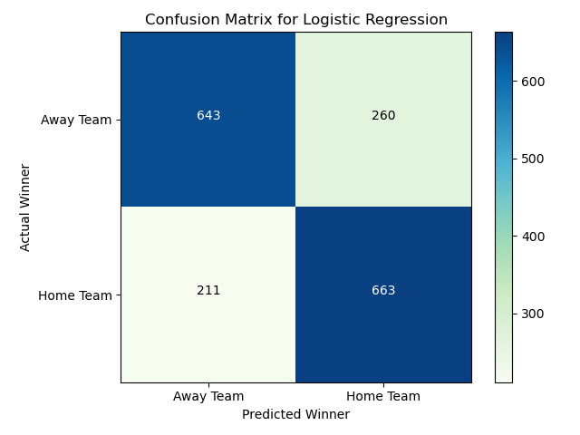
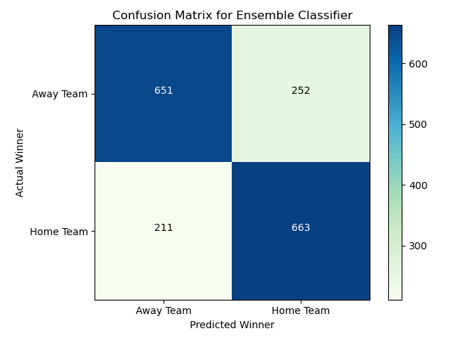

# 1. Introduction

FIFA World Cup is the most popular sports event in the world. As shown in the image below [5], its viewership surpasses all other major sports events. With the popularity of the sport comes the importance of predictive analysis of the tournament and its matches. A lot of industries seek a good prediction at different levels for these matches for different purposes like sports betting, media and broadcast analysis, tactical decision making, driving online fan excitement. 

FIFA World Cup happens once in four years with 32 participating teams. First, 8 groups are created with 4 teams each. In every group, each team plays the other once. 3 points are given to the winner, 0 to the loser, and 1 point each is awarded to the teams in case of a draw. After this, top 2 teams from each group qualify for the knockout stages.From the knockout the tournament trasnforms into single-death elimination mode.

In this work, we predict the FIFA World Cup matches and suggest an ideal grouping of teams for a balanced tournament using past match results and rankings. In summary, we use the data to generate and extract relevant features, and then use multiple supervised techniques to predict winner of a match. We implement multiple algorithms and do a thorough comparison of each of them. Apart from real data, we also explore creating fictitious matches and use semi-supervised learning in an attempt to improve the models. Alongside match predictions, we also use unsupervised clustering techniques to create groups that can facilitate a good tournament. Through these two processes, we create an end-to-end tool that can take in participating teams, build groups, predict results of matches and ultimately, predict a complete tournament.

# 2. Related Work

The problem of predicting game outcomes especially in Football (also called Soccer in North America) is usually handled as a classification problem [4],[6]. Techniques ranging from logistic regression [4] to RNN/Deep Learning [6] have been employed for this task. Furthermore the problem of outcome prediction is very similar across other team sports [1],[3]. A comprehensive survey of the use of techniques across the various sports is described in [3].

# 3. Method Overview

## 3.1 Problem Definition

A tournament \\(\mathcal{T}(\boldsymbol{T},\boldsymbol{G},\boldsymbol{T_b})\\) is a set of teams \\(\boldsymbol{T}\\) participating in games \\(\boldsymbol{G}\\) (either a winner or tie (only in  group stage)) over stages \\(\boldsymbol{b} = 0,1,2,...\\) ,with a set of (\\(\boldsymbol{T_b}\\)) teams qualifying to play them. Our goal is:

1. **Outcome prediction** : \\(\forall G(T_i,T_j) \in \boldsymbol{G}\\) we predict \\(\hat{G}(T_i,T_j)\\) accurately.
2. **Group Prediction** : Given  \\(\boldsymbol{T}\\) teams, we assign 8 groups \\(\boldsymbol{g}\\) such that \\(\|g_i\| = 4\\) and each \\(T_i \Rightarrow g_i\\). We select the groups such that stronger teams are not placed together to facilitate an interesting tournament. 

The notion of "accuracy" in the case of outcome prediction is gauged via metrics like "**Classification Accuracy**","**Precision/Recall**","**ROC/AUC score**" ,"**Confusion Matrix**" etc. The quality of the tournament groups on the other hand is established via clustering metrics like "**betaCV**" ,"**NormalizedCut**" , "**D-B Index** " and **Silhouette Score** .

## 3.2 Overall Pipeline

The above figure represents the overall pipeline of our Tournament Simulator. Given a set of input teams(in our case teams which have qualified for FIFA-2022), we  first use unsupervised clustering techniques to create ideal groups, then we simulate the matches between them under the tournament structure using our supervised match outcome predictors iteratively to determine the winner of the tournament.

# 4. Implementation Details

## 4.1 Dataset
To train our models, we use the datasets listed below:
- [Soccer World Cup Data (Kaggle)](https://www.kaggle.com/datasets/shilongzhuang/soccer-world-cup-challenge/)
- [All International Matches (Kaggle)](https://www.kaggle.com/datasets/martj42/international-football-results-from-1872-to-2017?select=results.csv)
- [FIFA World Rankings (Kaggle)](https://www.kaggle.com/datasets/cashncarry/fifaworldranking)

The dataset features are described in the following figure -

Of these the datasets **All International Matches** and **FIFA World Rankings** are used to train and test our Machine Learning schemes ,while the dataset **Soccer World Cup Data** is used to prepare and run tournament simulations.

#### 4.1.1 Data Cleaning

We initially began with data from various types of matches, including individual matches in FIFA World Cups, qualifiers, friendlies and matches from other tournaments. However, this did not yield favorable accuracy in prediction. This was probably because teams don't play to their full strength, particularly in friendlies, so it probably adds up noise. Thus, based on our domain knowledge of the tournament, we reduced the dataset to consider only include individual matches in FIFA World Cups and qualifiers. This yielded better results across all our methods. We also cleaned the data by replacing the names of countries which were listed differently in history as compared to now or synchronized their names in the match dataset and the fifa ranking dataset(for example South Korean football team's name is Korea Republic), so that there is consistency across various datasets. Apart from that, there was no missing data in the dataset.

#### 4.1.2 Feature Extraction

To predict the outcomes, we first extract features for a match fixture using domain knowledge and correlation analysis. For the two teams playing, we take last \\(n_{ind}\\) individual matches in FIFA World Cups and qualifiers against any team. From this, we extract number of wins, goals scored (mean, std), goals conceded (mean, std), mean of rank difference of this team against oppositions played for each team [7]. Alongside this, we also take in the current rank of the teams. After this, we take last \\(n_{h2h}\\) matches against each other in the same category and extract difference in rank of the teams and mean, std of goals scored by both the teams. We also take a categorical variable of whether the match is at a neutral venue, and if it is a world cup match or a qualifier. Complete set of features are described in the table below. To get the target/outcome labels, we compare the goals scored for both teams in the match and if home_team scores more, we make the label = 1, otherwise 0. The following table summarizes the  chosen features.

We explicitly omit ties from our use case  because of the following two reasons -
1. It did not correlate well with any feature or any combinations thereof from the available dataset that we have both during preliminary analysis and our attempts at predicting it using various ML techniques.
2. We hypothesize that the business side of the tournament is a knockout. For matches beyond the group stage in case of a tie, there is a penalty shootout, the outcome of which is difficult to predict with the data we have. Therefore, instead of settling for a random choice, we would instead select the team with higher probability of a win.

In the case of **Unsupervised Learning** we use the columns marked "Individual" as the feature set.

#### 4.1.3 Exploratory Data Analysis

After extracting the features, we analyze our data as below.

  
 

The graph above shows the correlation of features between themselves and with the label. First three columns/rows are labels. The 'h2h' prefix means head to head which is data when both teams face each other. As visible, the features are largely uncorrelated and have some coorelation with the output of 'Home Team Win' and 'Away Team Win' labels. Also, 'Draw' is not is not well correlated with any other feature.

 

 
 

We particularly want to visualize the distribution of goals scored/conceded for both individual teams and head to head (h2h) on the outcome of the match under consideration, which are given below. 'Win' here means win for the home team.

 

   
   
  
 

 

  
 

As we can see, these features are separable linearly at the tail ends on each side and have an overlap region in between where the outcome can not be determined by these features alone. This is where the ranking distributions and other features help. In head to head, the behavior is similar.

## 4.2 Models

Using features extracted above, we train a binary classifier using various algorithms. To start, we implement Logistic Regression [8], Support Vector Machines [9], Decision Tree [10] ,Naive Bayes and kNN  which are simple, efficient and interpretable algorithms and then move to ensemble classifiers like Random Forest [11], and Gradient Boost [12] for Decision Trees and Adaptive Boosting for Logistic Regression and Decision Trees to predict the probability of team labeled as home winning the match. We also create an "Ensemble Classifier" which combines the tuned models from the base class and makes inference by majority voting and returns the predicted probability for class labels as the average of all constituent models' and compare its performance with the others. In working with the classifier, we also experiment with forward feature selection [13] to select best features from the initial feature set, and also do Principal Component Analysis [14] to reduce the dimensionality of features. We tune all these methods by defining a search space and using Randomized Search followed by Grid Search using k-fold cross validation.

As we realize that the number of data can also be a cause of concern since World Cups happen once every four years in a space of two months, we generate artificial permutation of matches of two teams. To do this, we take a date \\(D\\) and team playing a match on that day \\(T_D\\). Then, for each team \\(T_D^i\\) in this set, if the team has played against a set \\(T_R\\) teams in the past, we generate a match between \\(T_D^i\\) and each member of set \\(T_R - T_D\\). After this, we select a random \\(N_A\\) set of matches from this and follow a semi-supervised learning [15] approach to train the classifier using labeled real matches and this unlabeled artificial matches to predict the results. We pass these unlabeled data points with the labels to iteratively predict the outcome of unlabeled points and add them to the training set if the confidence threshold of prediction is more than 0.75.

### Model Training

To select the features, we heuristically optimized \\(n_{ind}\\)=15 and \\(n_{h2h}\\)=15 by changing the values, training the models and analyzing the accuracy. We sweeped these values from 5 to 20 in steps of 5 and took the best combination.

To train the model, we started with splitting our dataset into 80% Training Data and 20% Test Data.

In all the learning algorithms employed we have a fixed set of hyperparameters (example penalty and 'c' for logistic regression, number of trees/tree depth/sampling rate for Random Forest etc). To tune these parameters we defined a search space and employed 2 types of searches, Randomized Search and Grid Search. Since this is a multivariate optimization problem, randomly sampling the parameters helps us narrow down the search space. We began with a Randomized Search in order to get to the vicinity of hyperparameters. Then, we conducted Grid Search in the proximity of the best performing solution of Randomized Search to fine tune a better performing set of hyperparameters. However, Grid Search did not yield significantly different results from the Randomized Search. Owing to the computational cost of Grid Search, we chose to run only Randomized Search. We did both of these using K-Fold Cross Validation with K = 5.

## 4.3 Unsupervised Learning
### Motivation 
For the FIFA world cup the group assignment is done in a ceremony via random draws without replacement on 4 "pots" of teams [16]. We explore whether there is a way to decide the tournament groups based on grouping teams of similar strength in a cluster but assigning them to different groups so that the overall tournament is balanced . The FIFA "pots" roughly emulate this via grouping teams in order of their rankings,however the group assignment is still done randomly. However we would be using additional features instead of just ranking to determine the clusters.Our guiding assumption for this exercise is that more balanced tournaments would be more interesting to watch and drive the popularity and revenue further. 

Given 32 teams and 8 groups and assuming the group numbers didn't matter the total number of ways to randomly form 8 distinct groups of 4 teams each would be \\(\frac{32!}{(4!)^88!} \sim 6 \times 10^{19}\\) . The heuristics stated above allow us to explore an exponentially smaller subset for our search . The notion of team strength is extracted and evaluated via Unsupervised Learning Techniques detailed below .
### Clustering Techniques 
Under our clustering schemes we first divide all the teams in 4 clusters of 8 teams each with the Unsupervised Technique and then we assign one team from each cluster to a group.The details for this assignment are discussed below:

1.**Constrained K-means** : This is a variation of the K-means clustering algorithm where we can control the cluster size[17]. Here we set the minimum and maximum of each cluster size to 8 simultaneousy for our task.The cluster to group assignment is done by sorting teams in ascending/descending order in terms of distance from the center of their repsective clusters and taking the top team from each cluster iteratively without replacement till we have 8 groups.

2.**GMM** : We compare and contrast the above scheme which is a hard clustering scheme with Gaussian Mixture Models which is a soft clustering scheme . Various initialization schemes are tried and the one that yields the best clustering metrics is chosen.In this case for each gaussian center we order the points by the cluster responsibilty at each cluster and the top elements from each cluster is selected and put in the same group one by one till we exhaust all teams.
# 5 Experiments

## 5.1 Supervised Model Performance

### 5.1.1 Base Models

We analyze the performance of the various classification schemes on our dataset using all standard metrics of evaluating a supervised learning algorithm. We primarily want to optimize the accuracy of the prediction, but since we have a balanced dataset and no bias towards avoiding either true negatives or false positives, we treat them fairly. Our final results are as shown below:

| Technique          | Accuracy | Precision | Recall | F-1 score | ROC-AUC |
| ------------------ | -------- | --------- | ------ | --------- | ------- |
| Logistic Regression| 73.49%   | 73.59%    | 73.49% | 73.49%    | 0.81    |
| SVM                | 73.38%   | 73.51%    | 73.38% | 73.37%    | 0.81    |
| Decision Tree      | 70.29%   | 70.46%    | 70.29% | 70.26%    | 0.77    |
| kNN                | 71.41%   | 71.51%    | 71.41% | 71.40%    | 0.80    |
| Naive Bayes        | 72.54%   | 72.54%    | 72.54% | 72.53%    | 0.80    |

### 5.1.2 Ensemble Models

| Technique                    | Accuracy | Precision | Recall | F-1 score | ROC-AUC |
| ---------------------------- | -------- | --------- | ------ | --------- | ------- |
| Logistic Regression(Adaboost)| 73.16%   | 73.30%    | 73.16% | 73.14%    | 0.81    |
| Decision Tree(Adaboost)      | 71.36%   | 71.50%    | 71.36% | 71.34%    | 0.81    |
| Random Forest                | 71.69%   | 71.81%    | 71.69% | 71.68%    | 0.80    |
| Gradient Boosting            | 71.52%   | 72.06%    | 71.52% | 71.41%    | 0.80    |
| Ensemble Classifier          | 73.94%   | 74.02%    | 73.94% | 73.94%    | 0.81    |

From the above table, we can see that **logistic regression** and **support vector machines** outperform other models except "**Ensemble Classifier**" . On hyperparameter tuning using SVM, linear kernel was chosen which explains similar results of Logistic Regression and SVM. The value of C chosen was 0.007 for SVM and 0.01 for Logistic Regression. The slight difference can be explained by choices made by random search.

Our "**Ensemble Classifier**" slightly outperforms all the other  models(by approximately \\(0.5 \% \\)).We believe that the other ensemble learning methods are not performing as well because the data is not enriched and complex enough to train them. This is also probably why we observed that for higher range of search space, the model over-fits and for relaxing the range to reduce over-fitting, the results are not as expected. The confusion matrices, learning curves and ROC curves of each of these methods are given below.
### 5.1.3 Confusion Matrix

#### Base Models

  
  
 

 

   
  
 

 

  
 

#### Ensemble Models 

  
  
 

 

   
  
 

 

  
 

### 5.1.4 Learning Curve

#### Base Models

  
  
 

 

   
  
 

 

   
 

-- Comments on kNN's learning curve --

#### Ensemble Models

  
  
 

 

   
  
 

### 5.1.5 ROC/AUC Curve

#### Base Models

  
  
  
 

 

 
  
 

  

 
 

#### Ensemble Models

  
  
  
 

 

 
  
 

  

 
 

## 5.2 Impact of Forward Feature Selection

Forward feature selection is the iterative addition of features to the model one at a time. The process starts with an empty set of features and gradually incorporates the most relevant features based on certain criteria, in our case the increase in accuracy of the model based on the set of features being added. Post forward feature selection, we found the accuracy of each model to be drop by approximately 3-5%. Due to this, we did not move forward with employing this technique. A possible hypothesis and explanation for this behavior is that individual features had lesser contribution to the accuracy of the model, and were enforced by other features of the dataset, thus leading to better accuracy without forward feature selection.

## 5.3 Impact of Principal Component Analysis

To analyze the impact of dimensionality reduction, we perform PCA on our features and run logistic regression and random forest on the features after doing PCA. After that, we select first five and first fifteen components and train the models using this data. The accuracy of each of these are given below -

|Method              |n=5     |n=15    |raw features|
|--------------------|--------|--------|------------|
|Logistic Regression | 71.75% | 72.70% | 73.16%     |
|Random Forest       | 72.76% | 72.53% | 71.86%     |

Interestingly, the trend in both algorithms are opposite. With logistic regression, more features/components yield more accuracy and with random forest, the vice versa. This probably suggests that Logistic Regression, which was working optimally before starts to suffer when we reduce the dimensions as it gets less information, whereas Random Forest, which was probably over-fitting originally despite hyperparameter tuning now is able to better learn the representation with reducing dimensionality. However, even with n=5 (best case), it is not able to outperform logistic regression with raw features.

## 5.4 Impact of Semi-supervised Learning

#### 5.4.1 Motivation and Procedure

Given the infrequency of the World Cup occurring every four years, the limited availability of data points posed a challenge for traditional supervised learning approaches. To overcome this constraint, we were motivated to explore semi-supervised learning for our prediction model. This adaptive methodology allows us to make the most out of the available labeled data while efficiently incorporating the valuable information from unlabeled data, thereby enhancing the robustness and effectiveness of our predictive model.

We implement semi-supervised learning [15] as described in section 4.2 on Logistic Regression and Random Forest and the results are below.

#### 5.4.2 Semi-supervised vs Supervised Learning
##### 5.4.2.1 Model Performance
We analyze the performance of the various classification schemes on our dataset as shown below:

| Technique          | Accuracy | Precision | Recall | F-1 score | ROC-AUC |
| ------------------ | -------- | --------- | ------ | --------- | ------- |
| Logistic Regression (Supervised)| 73.16%   | 73.30%    | 73.16% | 73.14%    | 0.81    |
| Logistic Regression (Semi Supervised) | 71.46%     | 71.92%     | 71.47%  | 71.37%      | 0.79    |
| Random Forest (Supervised)     | 71.86%   | 72.00%    | 71.86% | 71.84%    | 0.79    |
| Random Forest (Semi Supervised)      | 71.65%     | 71.77%      | 71.55%   | 71.6%      | 0.77    |

As we can see, there is no significant improvement in semi supervised learning over the supervised results. The possible reason is that these hyptohetical matches learn from a similar data representation and do not add a lot of variety to the dataset. Thus, only increasing the number of data points but not adding a lot of extra information probably impact the model slightly negatively. The confusion matrix and ROC curve for logistic regression supervised vs. semi-supervised are given below.

##### 5.4.2.2 Confusion Matrix

  
  
 

##### 5.4.2.3 ROC/AUC Curve
 

  
  
 

## 5.5 Tournament Simulation

### 5.5.1 Tournament Schedule

We are following the official FIFA World Cup match scheduling strategy. For this simulation, we have used the official FIFA World Cup 2022 Groups.
The groups are as follows:
#### WC Groups 
      Group A= ['Qatar', 'Ecuador', 'Senegal', 'Netherlands']
      Group B= ['England', 'Iran', 'USA', 'Wales']
      Group C= ['Argentina', 'Saudi Arabia', 'Mexico', 'Poland']
      Group D= ['France', 'Australia', 'Denmark', 'Tunisia']
      Group E= ['Spain', 'Costa Rica', 'Germany', 'Japan']
      Group F= ['Belgium', 'Canada', 'Morocco', 'Croatia']
      Group G= ['Brazil', 'Serbia', 'Switzerland', 'Cameroon']
      Group H= ['Portugal', 'Ghana', 'Uruguay', 'South Korea']

##### Total matches= 64
#### A.  Group Stage- 8 groups of 4 teams each 
     Each team plays 3 matches with the other teams in the group
     Total matches per group= 6 (4C2)
     Total matches= 48
#### B. Knockout Stages- Played after Group Stages
##### 1. Round of 16- 8 Matches (16C2 Matches) 
     First-place Group A vs. Second-place Group B- W1
     First-place Group B vs. Second-place Group A- W2
     First-place Group C vs. Second-place Group D- W3
     First-place Group D vs. Second-place Group C- W4
     First-place Group E vs. Second-place Group F- W5
     First-place Group F vs. Second-place Group E- W6
     First-place Group G vs. Second-place Group H- W7
     First-place Group H vs. Second-place Group G- W8
 
##### 2. Quarter Finals- 4 Matches (8C2) 
     W1 vs W2- QF_W1
     W3 vs W4- QF_W2
     W5 vs W6- QF_W3
     W7 vs W8- QF_W4
 
##### 3. Semi Finals- 2 Matches (4C2) 
     QF_W1 vs QF_W2- SF_W1
     QF_W3 vs QF_W4- SF_W2
 
##### 4. Play-offs/ Third Place- 1 Match (2C2)  
     Semi Final Losers
 
##### 5. Final- 1 Match 
     SF_W1 vs SF_W2

### Simulation
We have analysed the results using 5 different models:

  
  
 
  
 
 

From here, we can see that likely performance of all models are similar, as also indicated by the close performance scores. One reason why in reality Brazil did not win was because it lost to Croatia over penalty shootout on the given day. But, overall, it was a stronger team and more likely to win also. Argentina, the eventual winners are in the finals here as well. And, statistically, Brazil were a stronger team based on the features that we are using. So, in conclusion, we would say that our tournament predictor works well within error bounds.
## 5.6 Unsupervised Learning
### Clustering Results (KMeans)
-- 2D/3D scatter plot with cluster results (preferably PCAd) --

-- DB/S-H/N-C/bCV scores here --
### Clustering Results (GMM)
-- 2D/3D scatter plot with cluster results (preferably PCAd) --

-- DB/S-H/N-C/bCV scores here --
### A comparison of Hard and Soft Clustering Schemes

## Tournament Simulation with Grouping

We used unsupervised machine learning models, KMeans and GMM, to create the 8 FIFA groups that compete in the group stage of FIFA.

For this, we generated 4 clusters with 8 teams each and picked one team from each cluster and put it to a group. The final results are displayed in the following section. 

### KMeans Grouping Results
Following 8 FIFA groups were generated using KMeans:

| Group            | Team 1 | Team 2 | Team 3 | Team 4 |
| ---------------- | -------- | --------- | ------ | --------- | 
| A | Argentina | Switzerland | Tunisia | Wales |
| B | Netherlands | Senegal | Serbia | Cameroon |
| C | Croatia | Spain | Denmark | Saudi Arabia |
| D | France | Germany | Poland | Canada |
| E | Portugal | USA | Iran | Costa Rica |
| F | Belgium | Uruguay | South Korea | Qatar |
| G | England | Morocco | Japan | Ecuador |
| H | Brazil | Mexico | Australia | Ghana |

Using these groups, following are the predictions:

Prediction using Logistic Regression:

Prediction using Ensemble Model:

### Gaussian Mixture Model Grouping Results
Following 8 FIFA groups were generated using GMM:

| Group            | Team 1 | Team 2 | Team 3 | Team 4 |
| ---------------- | -------- | --------- | ------ | --------- | 
| A | Qatar | Netherlands | England | Poland |
| B | Ghana | Switzerland | Argentina | Australia |
| C | Ecuador | Germany | Portugal | Tunisia |
| D | Costa Rica | Morocco | Spain | Serbia |
| E | Saudi Arabia | Denmark | USA | Iran |
| F | Cameroon | Uruguay | France | Wales |
| G | Canada | Senegal | Brazil | Japan |
| H | South Korea | Mexico | Belgium | Croatia |

Using these groups, following are the predictions:

Prediction using Logistic Regression:

Prediction using Ensemble Model:

# 6 Scope for Improvement and Ideas for further exploration
Based on our understanding we believe the following areas could be  explored further to improve our analysis and to also generate new ideas:
1. **Ties** : Given our dataset we found that Ties/Draws are very difficult to predict with any reasonable accuracy. Could a different approach yield better results? For example if we were to predict the number of goals scored by each teams than just the win/loss probability with additional datasets could we make a more informed/accurate predicition of ties?
2. **True Tournament Prediction** : In our case we predicted the tournament outcome using a supervised classifier for predicting each match . Could we create a different kind of predictor that takes in the group of teams participating and predicts the full tournament with brackets while maintaining reasonable accuracy? 
3. **Team features using Player data** : For this project we extracted the relevant team features using past matches' data to understand/approximate the various defensive/offensive attributes a team might have.The same could be established via combining  the attributes of the relevant player(s).For example with everything remaining the same, a goalkeeper with a poor record may lower the defensive attributes of the team(this is not always desirable but sometimes forced because of injuries/other problems).Collating player data and using them to build team features is another area one could explore.

Most of the ideas and techniques employed in our project could be applied to other team based sports and their tournaments as well with some modifications ,and hence it would be an interesting exercise to do a comparative analysis to gauge the relative performance of different ML algorithms on different team sports.
# 7 Project Timeline and Responsibilities

## 7.1 Contributions for the Mid-Term

| Team Member | Responsibility |
|-------------|----------------|
| Ananya Sharma |  Logistic Regression, Results Evaluation and Analysis |
| Apoorva Sinha | Feature Selection, Dimensionality Reduction, Results Evaluation and Analysis |
| Neelabh Sinha |  kNN,Naive Bayes, Decision Tree, Gradient Boost, Random Forest, SVM,AdaBoost, Results Evaluation and Analysis |
| Snigdha Verma | Unsupervised Learning-GMM,Tournament Prediction Pipeline, Results Evaluation and Analysis |
| Yu- Chen Lin |  Unsupervised Learning- Constrained Kmeans,Test data annotation, Results Evaluation and Analysis |

## 7.2 Project Gantt Chart

The gantt chart covering complete timeline and responsibility distribution can be found [here](https://docs.google.com/spreadsheets/d/101ID8me3ChWkl0MzavG_UmaGsH9tkSGHOLhPi9ybc2Y/edit?usp=sharing).

# 8 References 
1. D. Delen, D. Cogdell, and N. Kasap, "A comparative analysis of data mining methods in predicting NCAA bowl outcomes," International Journal of Forecasting, vol. 28, no. 2, pp. 543–552, 2012.
2. T. Horvat and J. Job, "The use of machine learning in sport outcome prediction: A review," WIREs Data Mining and Knowledge Discovery, vol. 10, no. 5, p. e1380, 2020.
3. T. Horvat, J. Job, R. Logozar, and I. Livada, "A data-driven machine learning algorithm for predicting the outcomes of NBA games," Symmetry, vol. 15, no. 4, 2023.
4. D. Prasetio and D. Harlili, "Predicting football match results with logistic regression," in 2016 International Conference On Advanced Informatics: Concepts, Theory And Application (ICAICTA), 2016, pp. 1–5.
5. [Online]. Available: https://www.statista.com/chart/28766/global-reach-and-tv-viewership-of-the-fifa-world-cup
6. E. Tiwari, P. Sardar, and S. Jain, "Football Match Result Prediction Using Neural Networks and Deep Learning," in 2020 8th International Conference on Reliability, Infocom Technologies and Optimization (Trends and Future Directions) (ICRITO), Noida, India, 2020, pp. 229-231.
7. M. J. Dixon and S. G. Coles, "Modelling Association Football Scores and Inefficiencies in the Football Betting Market," Journal of the Royal Statistical Society: Series C (Applied Statistics), vol. 46, pp. 265-280, 1997. DOI: 10.1111/1467-9876.00065
8. D. R. Cox, "The regression analysis of binary sequences (with discussion)," Journal of the Royal Statistical Society: Series B (Methodological), vol. 20, no. 2, pp. 215-242, 1958.
9. B. E. Boser, I. M. Guyon, and V. N. Vapnik, "A training algorithm for optimal margin classifiers," in Proceedings of the fifth annual workshop on Computational learning theory, 1992, pp. 144-152.
10. J. R. Quinlan, "Induction of decision trees," Machine Learning, vol. 1, no. 1, pp. 81-106, 1986.
11. L. Breiman, "Random forests," Machine Learning, vol. 45, no. 1, pp. 5-32, 2001.
12. J. H. Friedman, "Greedy function approximation: A gradient boosting machine," Annals of Statistics, vol. 29, no. 5, pp. 1189-1232, 2001.
13. G. H. John and P. Langley, "Feature selection for high-dimensional genomic microarray data," Computer Methods and Programs in Biomedicine, vol. 56, no. 1, pp. 37-48, 1997. DOI: 10.1016/S0169-2607(98)00047-7
14. K. Pearson, "On Lines and Planes of Closest Fit to Systems of Points in Space," Philosophical Magazine Series 6, vol. 2, no. 11, pp. 559-572, 1901. DOI: 10.1080/14786440109462720
15. D. Yarowsky, "Unsupervised word sense disambiguation rivaling supervised methods," in Proceedings of the 33rd annual meeting on Association for Computational Linguistics (ACL ‘95), Association for Computational Linguistics, Stroudsburg, PA, USA, 1995, pp. 189-196.
16. [Online]. Available: https://www.fifa.com/tournaments/mens/worldcup/qatar2022/news/qatar-2022-final-draw-all-you-need-to-know
17. Bennett, K.P. and Bradley, P.S. and Demiriz, A.,"Constrained K-Means Clustering", MSR-TR-2000-65 , Microsoft Research 2000