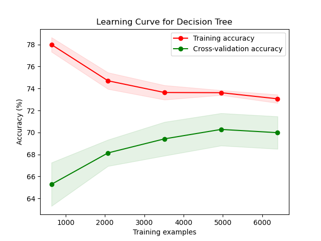

# 1. Introduction

FIFA World Cup is the most popular sports event in the world. As shown in the image below [5], its viewership surpasses all other major sports events. With the popularity of the sport comes the importance of predictive analysis of the tournament and its matches. A lot of industries seek a good prediction at different levels for these matches for different purposes like sports betting, media and broadcast analysis, tactical decision making, driving online fan excitement. 

FIFA World Cup happens once in four years with 32 participating teams. First, 8 groups are created with 4 teams each. In every group, each team plays the other once. 3 points are given to the winner, 0 to the loser, and 1-1 point is shared in case of a draw. After this, top 2 teams from each group qualify for knockout stages. In knockouts, each team plays a match per stage where winner moves to the next stage and loser is eliminated, until one team ultimately wins the tournament.

In this work, we predict the FIFA World Cup matches and ideal grouping of teams for a good tournament using past match results and rankings. In summary, we use these data to generate relevant features, and then use multiple supervised techniques to predict winner of a match. Apart from real data, we also explore creating fictitious matches and use semi-supervised learning in an attempt to improve the models. Alongside match predictions, we also use unsupervised clustering techniques to create groups that can facilitate a good tournament. Through these two processes, we create an end-to-end tool that can take in participating teams, build groups, predict results of matches and ultimately, predict a complete tournament.

# 2. Related Work

The problem of predicting game outcomes especially in Football (also called Soccer in North America) is usually handled as a classification problem [4],[6]. Techniques ranging from logistic regression [4] to RNN/Deep Learning [6] have been employed for this task. Furthermore the problem of outcome prediction is very similar across other team sports [1],[3]. A comprehensive survey of the use of techniques across the various sports is described in [3].

# 3. Method Overview

## 3.1 Problem Definition

A tournament \\(\mathcal{T}(\boldsymbol{T},\boldsymbol{G},\boldsymbol{T_b})\\) is a set of teams \\(\boldsymbol{T}\\) participating in games \\(\boldsymbol{G}\\) (either a winner or tie (only in  group stage)) over stages \\(\boldsymbol{b} = 0,1,2,...\\) ,with a set of (\\(\boldsymbol{T_b}\\)) teams qualifying to play them. Our goal is:

1. **Outcome prediction** : \\(\forall G(T_i,T_j) \in \boldsymbol{G}\\) we predict \\(\hat{G}(T_i,T_j)\\) accurately.
2. **Group Prediction** : Given  \\(\boldsymbol{T}\\) teams, we predict 8 groups \\(\boldsymbol{g}\\) such that \\(|g_i| = 4\\) and each \\(T_i -> g_i\\). 

The notion of "accuracy" in our case is also quantified by additional metrics like **cross-entropy** , **precision** , **recall** and **F1-score** (discussed below in the metrics section.)

For the mid-sem checkpoint we will be covering **Outcome Prediction** in the report.

## 3.2 Overall Pipeline

# 4. Implementation Details

## 4.1 Dataset
We use the datasets listed below:
- [Soccer World Cup Data (Kaggle)](https://www.kaggle.com/datasets/shilongzhuang/soccer-world-cup-challenge/)
- [All International Matches (Kaggle)](https://www.kaggle.com/datasets/martj42/international-football-results-from-1872-to-2017?select=results.csv)
- [FIFA World Rankings (Kaggle)](https://www.kaggle.com/datasets/cashncarry/fifaworldranking)

The dataset features are described in the following figure -

Of these the datasets **All International Matches** and **FIFA World Rankings** are used to train and test our Machine Learning schemes ,while the dataset **Soccer World Cup Data** is used to prepare and run tournament simulations.

#### 4.1.1 Data Cleaning

While we initially began with data from various types of matches, including individual matches in FIFA World Cups, qualifiers, friendlies and others. However, this did not yield favorable accuracy in prediction. Thus, based on our domain knowledge of the tournament, we reduced the dataset to consider only including individual matches in FIFA World Cups and qualifiers. This yielded better results across all employed methods.
#### 4.1.2 Feature Extraction
To predict the outcomes, we first extract features for a match fixture using domain knowledge and correlation analysis. For the two teams playing, we take last $n_{ind}$ individual matches in FIFA World Cups and qualifiers against any team. From this, we extract number of wins, goals scored (mean, std), goals conceded (mean, std), mean of rank difference of this team against oppositions played for each team. Alongside this, we also take in the current rank of the teams. After this, we take last $n_{h2h}$ matches against each other in the same category and extract difference in rank of the teams and mean, std of goals scored by both the teams. We also take a categorical variable of whether the match is at a neutral venue, and if it is a world cup match or a qualifier. Complete set of features are described in the table below. To get the labels, we compare the goals scored for both teams in the match and if home_team scores more, we make the label = 1, otherwise 0.

#### 4.1.3 Exploratory Data Analysis

## 4.2 Models

Using features extracted above, we train build a binary classifier using various algorithms. To start, we implement Logistic Regression [X], Support Vector Machines [X], Decision Tree [X] which are simple, efficient and interpretable algorithms and them move to ensemble methods like , Random Forest [X], and Gradient Boost [X] to predict the probability of team A winning the match. In working with the classifier, we also experiment with forward feature selection [X] to select best features from the initial feature set, and also do Principal Component Analysis [X] to reduce the dimensionality of features. We tune all these methods by defining a search space and using Randomized Search using k-fold cross validation.

As we realize that the number of data can also be a cause of concern since World Cups happen once every four years in a space of two months, we generate artificial permutation of matches of two teams. To do this, we take a date $D$ and team playing a match on that day $T_D$. Then, for each team $T_D^i$ in this set, if the team has played against a set $T_R$ teams in the past, we generate a match between $T_D^i$ and each member of set $T_R - T_D$. After this, we select a random $N_A$ set of matches from this and follow a semi-supervised learning [X] approach to train the classifier using labeled real matches and this unlabeled artificial matches to predict the results.

### 4.2.1 Model Training

We started with splitting our dataset into 80% Training Data and 20% Test Data.

In all the learning algorithms employed we have a fixed set of hyperparameters (example penalty and 'c' for logistic regression, number of trees/tree depth/sampling rate for Random Forest etc). To tune these parameters we employed 2 types of searches, RandomizedSearch and GridSearch. Since this is a multivariate optimization problem, randomly sampling the parameters helps us narrow down the search space. We began with a RandomizedSearchCV in order to get to the vicinity of hyperparameters. Then, we conducted GridSearch in the proximity of the best performing solution of RandomizedSearch to fine tune a better performing set of hyperparameters. However, this did not yield significantly different results from the RandomizedSearch. Owing to the computational cost of GridSearch, we chose to run only RandomizedSearch. 

In RandomizedSearch, we first defined the search space, and then used K-Fold Cross Validation with K = 5.

# 5 Experiments

## 5.1 Supervised Model Performance

We analyze the performance of the various classification schemes on our dataset as shown below:

| Technique          | Accuracy | Precision | Recall | F-1 score | ROC-AUC |
| ------------------ | -------- | --------- | ------ | --------- | ------- |
| Logistic Regression| 73.16%   | 73.30%    | 73.16% | 73.14%    | 0.81    |
| SVM                | 73.16%   | 73.23%    | 73.16% | 73.15%    | 0.81    |
| Decision Tree      | 70.29%   | 70.49%    | 70.29% | 70.25%    | 0.76    |
| Random Forest      | 71.86%   | 72.00%    | 71.86% | 71.84%    | 0.79    |
| Gradient Boosting  | 71.41%   | 71.94%    | 71.41% | 71.29%    | 0.79    |

From the above table, we can see that logistic regression and support vector machines outperform other models. On hyperparameter tuning using SVM, linear kernel was chosen which explains similar results of Logistic Regression and SVM. The value of C chosen was 0.007 for SVM and 0.01 for Logistic Regression. The slight difference can be explained by choices made my random search.

We believe that the ensemble learning methods are not performing as well because the data is not enriched and complex enough to train them. This is also probably why we observed that for higher range of search space, the model over-fits and for relaxing the range to reduce over-fitting, the results are not as expected.

### 5.1.1 Confusion Matrix

  
  
 

 

   
  
 

 

  
 

### 5.1.2 Learning Curve

  
  
 

 

   
  
 

 

   
 

  
  
  
 

 

 
  
 

  

 
 

## 5.2 Impact of Forward Feature Selection

Forward feature selection is the iterative addition of features to the model one at a time. The process starts with an empty set of features and gradually incorporates the most relevant features based on certain criteria, in our case the increase in accuracy of the model based on the set of features being added. Post forward feature selection, we found the accuracy of each model to be drop by 5%. Due to this, we did not move forward with employing this technique. A possible hypothesis and explanation for this behavior, is that individual features had lesser contribution to the accuracy of the model, and were enforced by other features of the dataset, thus leading to better accuracy without forward feature selection.

## 5.3 Impact of Principal Component Analysis
To analyze the impact of dimensionality reduction, we perform PCA on our features and run logistic regression and random forest on the features after doing PCA. After that, we select first five and first fifteen components and train the models using this data. The accuracy of each of these are given below -

|Method              |n=5     |n=15    |raw features|
|--------------------|--------|--------|------------|
|Logistic Regression | 71.75% | 72.70% | 73.16%     |
|Random Forest       | 72.76% | 72.53% | 71.86%     |

Interestingly, the trend in both algorithms are opposite. With logistic regression, more features/components yield more accuracy and with random forest, the vice versa. This probably suggests that Logistic Regression, which was working optimally before starts to suffer when we reduce the dimensions as it gets less information, whereas Random Forest, which was probably over-fitting originally despite hyperparameter tuning now is able to better learn the representation with reducing dimensionality. However, even with n=5 (best case), it is not able to outperform logistic regression with raw features.

## 5.4 Impact of Semi-supervised Learning
#### 5.4.1 Motivation 
Given the infrequency of the World Cup occurring every four years, the limited availability of data points posed a challenge for traditional supervised learning approaches. To overcome this constraint, we were motivated to explore semi-supervised learning for our prediction model. This adaptive methodology allows us to make the most out of the available labeled data while efficiently incorporating the valuable information from unlabeled data, thereby enhancing the robustness and effectiveness of our predictive model.

#### 5.4.2 Semi-supervised vs Supervised Learning
##### 5.4.2.1 Model Performance
We analyze the performance of the various classification schemes on our dataset as shown below:

| Technique          | Accuracy | Precision | Recall | F-1 score | ROC-AUC |
| ------------------ | -------- | --------- | ------ | --------- | ------- |
| Logistic Regression Supervised | 0.73     | 0.73      | 0.73   | 0.73      | 0.19    |
| Logistic Regression Semi Supervised | 0.71     | 0.72      | 0.71   | 0.71      | 0.79    |

| Technique          | Accuracy | Precision | Recall | F-1 score | ROC-AUC |
| ------------------ | -------- | --------- | ------ | --------- | ------- |
| RandomForest Supervised      | 0.72     | 0.72      | 0.72   | 0.72      | 0.21    |
| RandomForest Semi Supervised      | 0.72     | 0.72      | 0.72   | 0.72      | 0.77    |

##### 5.4.2.2 Confusion Matrix

  
  
 

##### 5.4.2.3 ROC/AUC Curve
 

  
  
 

## 5.5 Tournament Simulation

### 5.5.1 Tournament Schedule

We are following the official FIFA World Cup match scheduling strategy. For this simulation, we have used the official FIFA World Cup 2022 Groups.
The groups are as follows:
### 
    Group A= ['Qatar', 'Ecuador', 'Senegal', 'Netherlands']
    Group B= ['England', 'Iran', 'USA', 'Wales']
    Group C= ['Argentina', 'Saudi Arabia', 'Mexico', 'Poland']
    Group D= ['France', 'Australia', 'Denmark', 'Tunisia']
    Group E= ['Spain', 'Costa Rica', 'Germany', 'Japan']
    Group F= ['Belgium', 'Canada', 'Morocco', 'Croatia']
    Group G= ['Brazil', 'Serbia', 'Switzerland', 'Cameroon']
    Group H= ['Portugal', 'Ghana', 'Uruguay', 'South Korea']
##### Total matches= 64
#### A.  Group Stage- 8 groups of 4 teams each 
     Each team plays 3 matches with the other teams in the group
     Total matches per group= 6 (4C2)
     Total matches= 48
#### B. Knockout Stages- Played after Group Stages
##### 1. Round of 16- 8 Matches (16C2 Matches) 
     First-place Group A vs. Second-place Group B- W1
     First-place Group B vs. Second-place Group A- W2
     First-place Group C vs. Second-place Group D- W3
     First-place Group D vs. Second-place Group C- W4
     First-place Group E vs. Second-place Group F- W5
     First-place Group F vs. Second-place Group E- W6
     First-place Group G vs. Second-place Group H- W7
     First-place Group H vs. Second-place Group G- W8
 
##### 2. Quarter Finals- 4 Matches (8C2) 
     W1 vs W2- QF_W1
     W3 vs W4- QF_W2
     W5 vs W6- QF_W3
     W7 vs W8- QF_W4
 
##### 3. Semi Finals- 2 Matches (4C2) 
     QF_W1 vs QF_W2- SF_W1
     QF_W3 vs QF_W4- SF_W2
 
##### 4. Play-offs/ Third Place- 1 Match (2C2)  
     Semi Final Losers
 
##### 5. Final- 1 Match 
     SF_W1 vs SF_W2

### Simulation
We have analysed the results using 5 different models:

  
  
 
  
 
 

<!-- ----To see further (Neelabh's checkpoint) ------ -->

# 6 Post Mid-Term Work
In our upcoming project phase, we aim to leverage unsupervised machine learning techniques, specifically K-means and Gaussian Mixture Models (GMM), to cluster all participating teams in the FIFA World Cup. This clustering approach will enable us to form eight distinct groups, providing a novel perspective for enhancing our tournament simulations. By incorporating unsupervised clustering insights into our pipeline, we anticipate gaining valuable information for refining the calibration of our supervised classifiers. This innovative methodology aims to contribute to a more accurate prediction model and ultimately enhance our ability to forecast the World Cup winner.
# 7 Project Timeline and Responsibilities

## 7.1 Contributions for the Mid-Term

| Team Member | Responsibility |
|-------------|----------------|
| Ananya Sharma |  Logistic Regression, Results Evaluation and Analysis |
| Apoorva Sinha | Feature Selection, Dimensionality Reduction, Results Evaluation and Analysis |
| Neelabh Sinha |  Decision Tree, Gradient Boost, Random Forest, SVM, Results Evaluation and Analysis |
| Snigdha Verma | Tournament Prediction Pipeline, Results Evaluation and Analysis |
| Yu- Chen Lin |  Test data annotation, Results Evaluation and Analysis |

## 7.2 Project Gantt Chart

The gantt chart covering complete timeline and responsibility distribution can be found [here](https://docs.google.com/spreadsheets/d/101ID8me3ChWkl0MzavG_UmaGsH9tkSGHOLhPi9ybc2Y/edit?usp=sharing).

# 8 References 
1. D. Delen, D. Cogdell, and N. Kasap. A comparative analysis of data mining methods in predicting ncaa bowl outcomes.International Journal of Forecasting, 28(2):543–552, 2012 .
2. T. Horvat and J. Job. The use of machine learning in sport outcome prediction: A review.WIREs Data Mining and Knowledge Discovery, 10(5):e1380, 2020.
3. T. Horvat, J. Job, R. Logozar, and . Livada. A data-driven machine learning algorithm for predicting the outcomes of nba games.Symmetry, 15(4), 2023.
4. D. Prasetio and D. Harlili. Predicting football match results with logistic regression.2016 International Conference On Advanced Informatics: Concepts, Theory And Application (ICAICTA), pages 1–5, 2016.
5. https://www.statista.com/chart/28766/global-reach-and-tv-viewership-of-the-fifa-world-cup
6. E. Tiwari, P. Sardar and S. Jain, "Football Match Result Prediction Using Neural Networks and Deep Learning," 2020 8th       International Conference on Reliability, Infocom Technologies and Optimization (Trends and Future Directions) (ICRITO), Noida, India, 2020, pp. 229-231, doi: 10.1109/ICRITO48877.2020.9197811.
7. Dixon, M.J. and Coles, S.G. (1997), Modelling Association Football Scores and Inefficiencies in the Football Betting Market. Journal of the Royal Statistical Society: Series C (Applied Statistics), 46: 265-280. https://doi.org/10.1111/1467-9876.00065